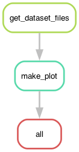
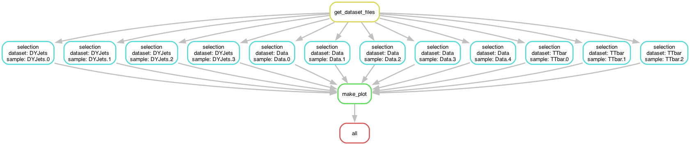

+++
title = "Dynamic Scatter-Gather with Checkpoints"
weight = 25
teaching = 15
exercises = 10
questions = [
  "When are ordinary wildcards no longer enough?",
  "What does a `checkpoint` do in Snakemake?",
  "How does Snakemake expand the DAG after files are discovered at run time?"
]
objectives = [
  "Recognise when a workflow needs a `checkpoint`.",
  "Write a checkpoint that discovers input files and records them in manifest files.",
  "Use `checkpoints.<name>.get()` inside an input function.",
  "Interpret the DAG before and after checkpoint expansion."
]
keypoints = [
  "Use a `checkpoint` when the downstream file list is only known after an earlier step has run.",
  "A `checkpoint` lets Snakemake pause, run a discovery step, and then reevaluate the DAG.",
  "Input functions can inspect `checkpoint` outputs and construct the downstream targets dynamically.",
  "If the file list is already known in advance, ordinary wildcards and `expand()` are simpler."
]
+++

In the previous episode, we listed the datasets and chunk identifiers in
advance. That works well when the workflow already knows what files it should
process.

Sometimes, however, the file list is only known after an earlier step has run.
For example, you might first scan a directory, query a bookkeeping service such as
[DAS](https://cmsweb.cern.ch/das/) (in CMS) or Rucio, or more generally,
produce one manifest file per dataset. In those cases, the downstream jobs
cannot be fully determined at the start of the workflow. This is where
Snakemake `checkpoint`s become useful.

## When You Need a Checkpoint

If you already know the files you want to process, use ordinary wildcards and
`expand()`. That is simpler and easier to read.

Use a `checkpoint` only when an earlier rule must first discover the files that
later rules will process.


We keep the same physics story as before: run a selection on many event files
and gather the results into one summary. The new part is that the list of files
is discovered by the workflow itself.


## A Checkpoint for File Discovery

We begin with a checkpoint that writes one manifest file per dataset:

```python
DATASETS = ["DYJets", "TTbar", "Data"]


checkpoint get_dataset_files:
    output:
        expand("file_lists/{dataset}.txt", dataset=DATASETS)
    params:
        datasets=" ".join(DATASETS)
    shell:
        """
        mkdir -p file_lists

        for dataset in {params.datasets}; do
            find "input/$dataset" -maxdepth 1 -type f -name "*.txt" | sort > "file_lists/$dataset.txt"
            test -s "file_lists/$dataset.txt"
        done
        """
```

Each output file under `file_lists/` contains the discovered input files for
one dataset. In a real analysis, the same pattern could come from a DAS/Rucio
query, an EOS directory scan, or some metadata service.

At this stage, it is useful to run only the checkpoint outputs and inspect what
they contain:

```bash
pixi run snakemake --cores 1 \
    file_lists/DYJets.txt \
    file_lists/TTbar.txt \
    file_lists/Data.txt
```

Now inspect one of the manifest files to see what the checkpoint produces:

```bash
cat file_lists/DYJets.txt
```

## Turning Manifest Files into Downstream Targets

After the checkpoint has run, we can also inspect its outputs programmatically
and build the list of files that should be created by the selection step:

```python
from pathlib import Path


def selected_files(_wildcards):
    manifest_files = checkpoints.get_dataset_files.get().output
    outputs = []

    for manifest in map(Path, manifest_files):
        dataset = manifest.stem

        with open(manifest, "r", encoding="utf-8") as handle:
            for line in handle:
                source_path = line.strip()

                if not source_path:
                    continue

                source = Path(source_path)
                outputs.append(str(Path("selected") / dataset / source.name))

    return outputs
```

The crucial line is:

```python
checkpoints.get_dataset_files.get()
```

This tells Snakemake:

1. run the checkpoint if needed
1. wait until its outputs exist
1. then reevaluate the input function using those outputs

In this lesson, we read the manifest files directly because it makes the reason
for the checkpoint easy to see. Another common pattern is to use
`glob_wildcards()` after the checkpoint has materialised its outputs.

## The Full Workflow

Putting the pieces together gives:

```python
from pathlib import Path


DATASETS = ["DYJets", "TTbar", "Data"]


def selected_files(_wildcards):
    manifest_files = checkpoints.get_dataset_files.get().output
    outputs = []

    for manifest in map(Path, manifest_files):
        dataset = manifest.stem

        with open(manifest, "r", encoding="utf-8") as handle:
            for line in handle:
                source_path = line.strip()

                if not source_path:
                    continue

                source = Path(source_path)
                outputs.append(str(Path("selected") / dataset / source.name))

    return outputs


rule all:
    input:
        "plots/event_counts.txt"


checkpoint get_dataset_files:
    output:
        expand("file_lists/{dataset}.txt", dataset=DATASETS)
    params:
        datasets=" ".join(DATASETS)
    shell:
        """
        mkdir -p file_lists

        for dataset in {params.datasets}; do
            find "input/$dataset" -maxdepth 1 -type f -name "*.txt" | sort > "file_lists/$dataset.txt"
            test -s "file_lists/$dataset.txt"
        done
        """


rule select_events:
    input:
        "input/{dataset}/{sample}.txt"
    output:
        "selected/{dataset}/{sample}.txt"
    shell:
        """
        mkdir -p "selected/{wildcards.dataset}"
        grep "Selected" "{input}" > "{output}" || test $? -eq 1
        """


rule make_plot:
    input:
        selected_files
    output:
        "plots/event_counts.txt"
    script:
        "plot.py"
```

Notice what has disappeared compared with the previous episode: we no longer
need a manually written `CHUNKS = [...]` list. The workflow discovers the files
and uses them to define the downstream jobs.

We also reuse the same `plot.py` script from the previous episode. The gather
logic does not need to change; only the way Snakemake discovers its inputs is
new.

## What the DAG Looks Like

Before the checkpoint has run, Snakemake cannot yet know which `select_events`
jobs will exist. The workflow therefore starts with a much smaller DAG:



After the checkpoint has produced the manifest files, Snakemake reevaluates the
workflow and expands the full scatter-gather structure:



This is the core idea of a checkpoint: the DAG is not fully known at the start,
so Snakemake has to discover part of it during execution.

## Running the Workflow

Start with a dry-run:

```bash
pixi run snakemake -n -p
```

Then run the workflow:

```bash
pixi run snakemake --cores 4
```

The execution has two phases:

1. Snakemake runs `get_dataset_files`.
1. It updates the checkpoint dependencies.
1. It schedules the individual `select_events` jobs.
1. It runs `make_plot` once all selected files are ready.

That is why checkpoint workflows can feel different from ordinary static DAGs:
Snakemake discovers part of the workflow as it goes.



Imagine that you already know the dataset names and chunk identifiers before
the workflow starts.

Should you still use a checkpoint?


Usually not. If the file list is already known in advance, ordinary wildcards
and `expand()` are simpler and easier to maintain.

A checkpoint is most useful when the downstream file list depends on something
that must first be discovered at run time.


